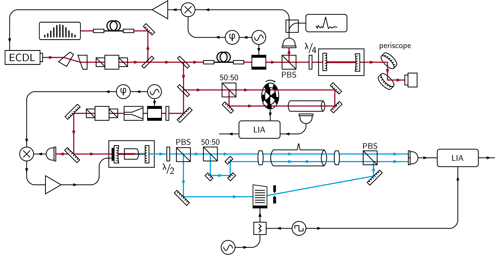

# OpticsComponentLibrary-LineArt
**Clear and neutral vector graphics library for illustrations of optics experiments (e.g. in laser physics).**

## Usage
* Single svg file with all images for convenient 'copy and paste', recommended to be used with [Inkscape](https://inkscape.org/). 
* Annotations and symbol palette set up with the font [CMU Sans Serif](https://fontlibrary.org/index.php?pretty=%2Fen%2Ffont%2Fcmu-sans-serif).

## License
The OpticsComponentLibrary-LineArt is a derivative of [gwoptics ComponentLibrary](http://www.gwoptics.org/ComponentLibrary/) by Alexander Franzen, used under the [Creative Commons Attribution-NonCommercial 3.0 Unported License](https://creativecommons.org/licenses/by-nc/3.0/). Besides adding additional optics and electronics components, the original work has been modified both visually and technically.

 
ComponentLibrary-LineArt by H. Schürg is licensed under a [Creative Commons Attribution-NonCommercial 4.0 International License](https://creativecommons.org/licenses/by-nc/4.0/).

Although always appreciated, I explicitly waive the requirement for attribution when the library is used to create a small number of illustrations for a new work, such as a *research paper* or a *web page*. However in all other cases, for example, when the library or its components are distributed, or if the library is used to illustrate major parts of a larger work, such as a book or PhD thesis, the creator H. Schürg must be acknowledged as specified in by the Creative Commons license above. 
